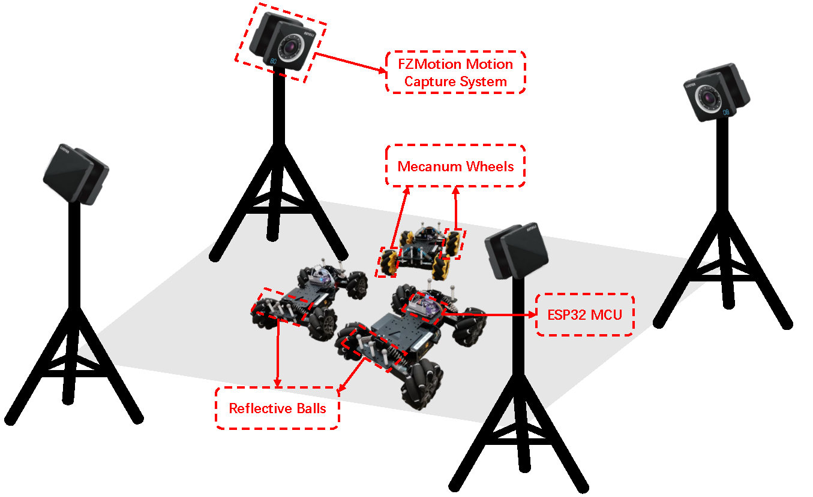
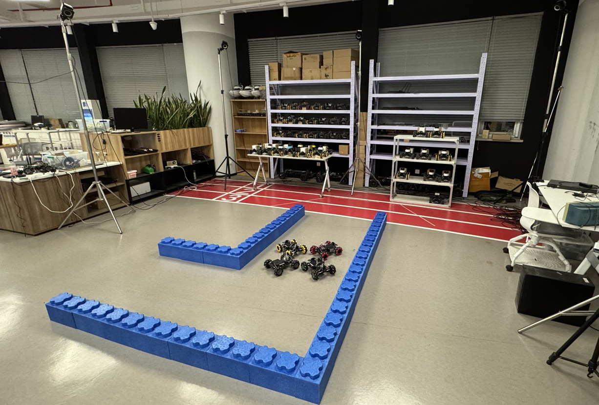

# Leader-Following Formation Control for Cooperative Transportation of Multiple Mecanum-Wheeled Mobile Robots

This repository contains the code and experimental data for the cooperative transportation system of **Mecanum-wheeled robots** based on the **leader-follower formation control** strategy. The work demonstrates the application of a decentralized, communication-free control framework for multi-robot cooperation in complex environments. The experimental validation of the proposed method is shown through a series of controlled tests involving multiple robots performing formation tracking and cooperative transport tasks.

## Overview

The proposed control system allows multiple Mecanum-wheeled robots to collaborate in a leader-follower formation without relying on global positioning systems (GPS) or inter-robot communication. The robots rely on **local relative measurements** from onboard sensors (e.g., cameras, LiDAR) to maintain formation and transport tasks. This method is particularly suited for applications in **constrained environments** where traditional GPS-based systems may fail or where communication is limited.

## Experimental Setup

The experiments were conducted using **four robots** in a controlled laboratory environment. A motion capture system was used to acquire precise relative position and orientation data of the robots for algorithm validation. The robots are equipped with onboard sensors for real-world deployment, and the system was validated under different operational conditions.

|  |  |
|:----------------------------------------------------:|:----------------------------------------------------:|
| (a) Motion capture sytem and mecanum mobile robots.  |    (b) Experiment field (a simulated warehouse).     |

*Figure 1: Experimental setup and environment.*

### Experimental Video

You can view the full experimental video demonstrating the robots’ operation and coordination during the cooperative transport task:

<video width="500" controls>
  <source src="https://github.com/user-attachments/assets/43492809-482d-4840-b3fc-7d7ed200ce60" type="video/mp4">
  Your browser does not support the video tag.
</video>

*Video 1: Experimental video showing the robots performing formation control.*

<video width="500" controls>
  <source src="https://github.com/user-attachments/assets/43492809-482d-4840-b3fc-7d7ed200ce60" type="video/mp4">
  Your browser does not support the video tag.
</video>

*Video 2: Experimental video showing the robots performing cooperative transportation.*

## Features
* **Rhombic-Dodecahedral Velocity Constraints Modeling**: First geometric characterization of Mecanum-wheeled robots' velocity limits as a **rhombic dodecahedron**, enabling safe and precise motion planning in confined spaces.  

* **Communication-Free Decentralized Control**: Leader-follower formation control **without inter-robot comms or global positioning** – each robot acts solely on local sensor data (e.g., LiDAR/camera).  

* **Disturbance-Robust Tracking via Velocity Observer**: Real-time leader velocity estimation compensates slippage/heading deviations, guaranteeing **bounded formation errors** under payload disturbances.  

## Code

The system is implemented through a multi-layer architecture:
- **Upper Layer (ROS-based Perception, Decision & Control)**  
  Implemented in **Python and C++** using ROS (Robot Operating System) for:
  - Real-time perception processing
  - Formation decision-making
  - Leader-follower control logic
- **Lower Layer (Robot Drive Control)**  
  Implemented in **Arduino C++** for:
  - Low-level Mecanum wheel actuation
  - Motor control and odometry processing

The repository includes:
* **Controller Implementation**: Code for the decentralized leader-follower control strategy.
* **Observer Design**: Implementation of the velocity observer to estimate the leader’s velocity.
* **Experimental Scripts**: Scripts to validate the system’s performance in controlled experiments.

## License

This project is licensed under the Apache License 2.0 - see the [LICENSE](./LICENSE) file for details.